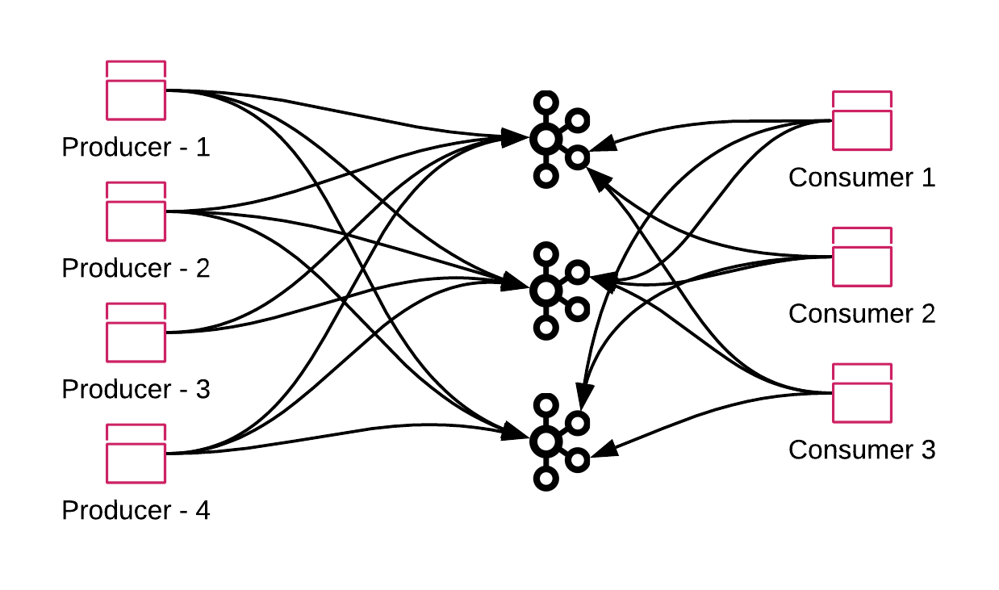
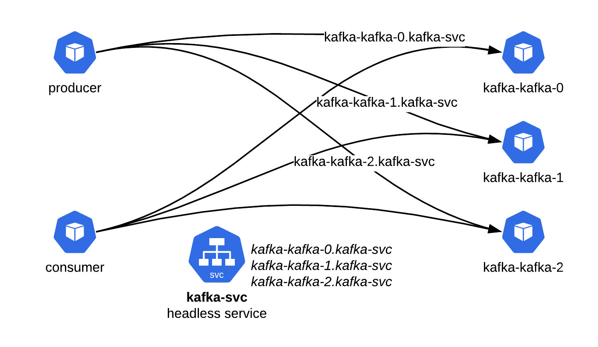
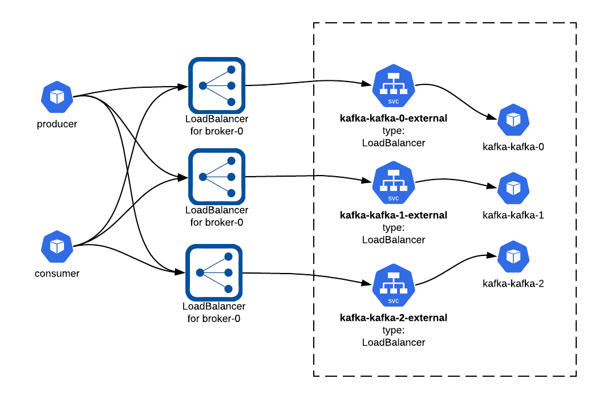
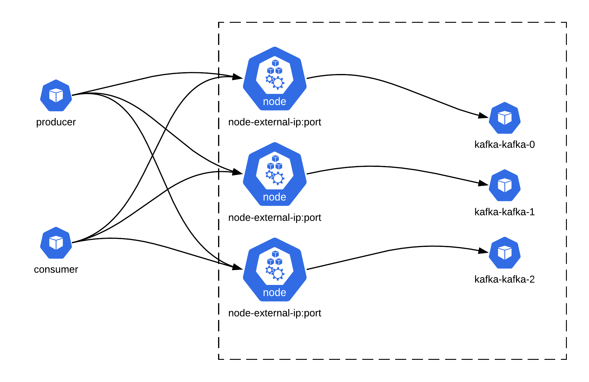

# KUDO Kafka Access

Kafka is a fully distributed messaging system as it persists, receives and sends records on different brokers.

Which in result makes it easier to scale it horizontally and provides guarantees for an architecture that can be fault tolerant.

To fully take advantage of the Apache Kafka sharding, a typical scenario would be where different producers and consumers are connecting to all Kafka brokers and writing and reading messages from the brokers. 



To achieve this, we need to guarantee that the producers and consumers can directly access the brokers from inside and outside of a Kubernetes cluster. 

## Internal access

For the applications living inside the same kubernetes cluster. KUDO Kafka supports the headless service. 




## External access

For the producers and consumers living outside the Kubernetes cluster KUDO Kafka supports the Nodeport and Loadbalancer approach.

#### Loadbalancer (recommended)

Exposing the Apache Kafka brokers using the LoadBalancer Service Type is the recommended way for the KUDO Kafka.

KUDO Kafka can be exposed easily for external access using Service Type [LoadBalancer](https://kubernetes.io/docs/concepts/services-networking/service/#loadbalancer).

The parameter used to configure the external loadbalancers is `EXTERNAL_ADVERTISED_LISTENER_TYPE`

When set to `LoadBalancer` it creates one service per broker to expose each broker externally. 

```
kubectl kudo install kafka --instance=kafka \
	-p EXTERNAL_ADVERTISED_LISTENER=true \
	-p EXTERNAL_ADVERTISED_LISTENER_TYPE=LoadBalancer
```



For these Kubernetes Services, KUDO Kafka uses the `externalTrafficPolicy:local` to avoid any second hop. As each broker gets its own loadbalancer we can avoid the extra hops and get a better network performance.

```
kubectl get svc
NAME                     TYPE           CLUSTER-IP    EXTERNAL-IP                                                               PORT(S)                      AGE
kafka-kafka-0-external   LoadBalancer   10.0.13.34    aebb0d2f2adda4b22b7d9b0c07a865b8-1700665253.us-west-2.elb.amazonaws.com   9097:31713/TCP               11s
kafka-kafka-1-external   LoadBalancer   10.0.45.151   a8ae206a726b24fed91b82eb9110e0d1-1872607345.us-west-2.elb.amazonaws.com   9097:30786/TCP               11s
kafka-kafka-2-external   LoadBalancer   10.0.32.219   a252e64a36f4443ecbea2fa4c4bf8441-1574422153.us-west-2.elb.amazonaws.com   9097:32048/TCP               11s
```

Producers and consumers can connect to `aebb0d2f2adda4b22b7d9b0c07a865b8-1700665253.us-west-2.elb.amazonaws.com:9097,a8ae206a726b24fed91b82eb9110e0d1-1872607345.us-west-2.elb.amazonaws.com:9097,a252e64a36f4443ecbea2fa4c4bf8441-1574422153.us-west-2.elb.amazonaws.com:9097` in the above case.

To verify if the `server.properties` has the correct configuration for the `listeners`,`advertised.listeners` and `listener.security.protocol.map`, users can check the `server.properties` content in the broker pods. For example for broker `2` you just need to run the following command:

```
> kubectl exec -ti kafka-kafka-2 -c k8skafka cat server.properties
[ ... lines removed for clarity ...]
listeners=INTERNAL://0.0.0.0:9095,EXTERNAL_INGRESS://0.0.0.0:9097
advertised.listeners=INTERNAL://kafka-kafka-2.kafka-svc.default.svc.cluster.local:9095,EXTERNAL_INGRESS://a252e64a36f4443ecbea2fa4c4bf8441-1574422153.us-west-2.elb.amazonaws.com:9097
listener.security.protocol.map=INTERNAL:PLAINTEXT,EXTERNAL_INGRESS:PLAINTEXT
inter.broker.listener.name=INTERNAL
[ ... lines removed for clarity ...]
```

In the above case we can see that loadbalancer hostname is listed in `advertised.listeners` and listening on `PLAINTEXT` protocol. 

To have the loadbalancer hostname, KUDO Kafka brokers wait for the loadbalancer hostname or IP address to be assigned. And add the address to the `advertised.listeners`  

##### Enabling/Disabling Loadbalancer access in already running KUDO Kafka  

KUDO Kafka supports enabling and disabling of the parameter `EXTERNAL_ADVERTISED_LISTENER`. This allows users to switch on and off the loadbalancers for an already running KUDO Kafka cluster.

To enable the external access via load balancers:

```
kubectl kudo update --instance=kafka \
	-p EXTERNAL_ADVERTISED_LISTENER=true \
	-p EXTERNAL_ADVERTISED_LISTENER_TYPE=LoadBalancer 
```

To disable the external access via load balancers:

```
kubectl kudo update --instance=kafka \
	-p EXTERNAL_ADVERTISED_LISTENER=false
```

#### Nodeports

Exposing the Apache Kafka brokers using the NodePorts Service Type **isn't a recommended way for the KUDO Kafka in production**. But it can help during development and testing environments, when user isn't looking for an external LoadBalancer service. 

The parameter used to configure the external loadbalancers is `EXTERNAL_ADVERTISED_LISTENER_TYPE`

When set to `NodePort` it creates one service per broker. 

```
kubectl kudo install kafka --instance=kafka \
	-p EXTERNAL_ADVERTISED_LISTENER=true \
	-p EXTERNAL_ADVERTISED_LISTENER_TYPE=NodePort
```



To verify if the NodePorts services are configured correctly, we can check the services created:

```
> kubectl get svc
NAME                     TYPE        CLUSTER-IP    EXTERNAL-IP   PORT(S)                      AGE
kafka-kafka-0-external   NodePort    10.0.16.144   <none>        30902:30902/TCP              110s
kafka-kafka-1-external   NodePort    10.0.63.204   <none>        30903:30903/TCP              110s
kafka-kafka-2-external   NodePort    10.0.11.74    <none>        30904:30904/TCP              110s
```

In this case we don't have an `EXTERNAL-IP` and this is expected. To access those brokers externally we would need the nodes external ip addresses to be added to the KUDO Kafka `server.properties`. 

We can verify them by checking the `server.properties`

```
> kubectl exec -ti kafka-kafka-2 -c k8skafka cat server.properties
[ ... lines removed for clarity ...]
advertised.listeners=INTERNAL://kafka-kafka-2.kafka-svc.default.svc.cluster.local:9093,EXTERNAL_INGRESS://34.214.27.71:30904
[ ... lines removed for clarity ...]
```

`34.214.27.71` in this case is the node external-ip where the pod is running.

Another way to get the list of all brokers addresses is:

```
kubectl exec -ti kafka-kafka-0 -c k8skafka cat external.advertised.listeners
kubectl exec -ti kafka-kafka-1 -c k8skafka cat external.advertised.listeners
kubectl exec -ti kafka-kafka-2 -c k8skafka cat external.advertised.listeners
kubectl exec -ti kafka-kafka-1 cat external.advertised.listeners
kubectl exec -ti kafka-kafka-2 cat external.advertised.listeners
```

That should give an output similar to:

```
EXTERNAL_INGRESS://34.221.252.205:30902
EXTERNAL_INGRESS://54.202.126.173:30903
EXTERNAL_INGRESS://34.214.27.71:30904
```

This also explains why using NodePort in production isn't recommended. As in case if any node loss or in case a broker is scheduled to a new node, the external-ip address will be changed. The same case is handled well by the `LoadBalancer` alternative.

##### Enabling/Disabling NodePort access in already running KUDO Kafka  

KUDO Kafka supports enabling and disabling of the parameter `EXTERNAL_ADVERTISED_LISTENER`. This allows users to switch on and off the nodeports access for an already running KUDO Kafka cluster.

To enable the external access via node ports:

```
kubectl kudo update --instance=kafka \
	-p EXTERNAL_ADVERTISED_LISTENER=true \
	-p EXTERNAL_ADVERTISED_LISTENER_TYPE=NodePort 
```

To disable the external access via load balancers:

```
kubectl kudo update --instance=kafka \
	-p EXTERNAL_ADVERTISED_LISTENER=false
```

#### Switching access type in running cluster

Due to known kubernetes issue in [issues/221](https://github.com/kubernetes/kubectl/issues/221) switching the Loadbalancer access to Nodeport access and vice versa, is a two step update

##### Switching from Nodeport to Loadbalancer

First disable the external access

```
kubectl kudo update --instance=kafka \
	-p EXTERNAL_ADVERTISED_LISTENER=false
```

Once the plan status is complete, we can enable again with `LoadBalancer` type

````
kubectl kudo install kafka --instance=kafka \
	-p EXTERNAL_ADVERTISED_LISTENER=true \
	-p EXTERNAL_ADVERTISED_LISTENER_TYPE=LoadBalancer
````

##### Switching from Loadbalancer to Nodeport

First disable the external access

```
kubectl kudo update --instance=kafka \
	-p EXTERNAL_ADVERTISED_LISTENER=false
```

Once the plan status is complete, we can enable again with `NodePort` type

```
kubectl kudo install kafka --instance=kafka \
	-p EXTERNAL_ADVERTISED_LISTENER=true \
	-p EXTERNAL_ADVERTISED_LISTENER_TYPE=NodePort
```

## Security

[KUDO Kafka Security options](./security.md) plays well with the external access. Enabling Kerberos or TLS authentication methods will modify the required external security protocol map. 

##### Loadbalancer with TLS encryption enabled

Exposing KUDO Kafka works with the TLS encryption enabled. 

```
kubectl kudo install kafka --instance=kafka \
	-p EXTERNAL_ADVERTISED_LISTENER=true \
	-p EXTERNAL_ADVERTISED_LISTENER_TYPE=LoadBalancer \
	-p CLIENT_PORT_ENABLED=false \
	-p TRANSPORT_ENCRYPTION_ENABLED=true \
	-p TLS_SECRET_NAME=kafka-tls
```

And we can verify that `EXTERNAL_INGRESS` is using `SSL` protocol.

```
> kubectl exec -ti kafka-kafka-2 -c k8skafka cat server.properties
[ ... lines removed for clarity ...]
listeners=INTERNAL://0.0.0.0:9095,EXTERNAL_INGRESS://0.0.0.0:9097
advertised.listeners=INTERNAL://kafka-kafka-2.kafka-svc.default.svc.cluster.local:9095,EXTERNAL_INGRESS://a252e64a36f4443ecbea2fa4c4bf8441-1574422153.us-west-2.elb.amazonaws.com:9097
listener.security.protocol.map=INTERNAL:SSL,EXTERNAL_INGRESS:SSL
inter.broker.listener.name=INTERNAL
[ ... lines removed for clarity ...]
```

##### Nodeport with TLS encryption enabled

Exposing KUDO Kafka works with the TLS encryption enabled. 

```
kubectl kudo install kafka --instance=kafka \
	-p EXTERNAL_ADVERTISED_LISTENER=true \
	-p EXTERNAL_ADVERTISED_LISTENER_TYPE=NodePort \
	-p CLIENT_PORT_ENABLED=false \
	-p TRANSPORT_ENCRYPTION_ENABLED=true \
	-p TLS_SECRET_NAME=kafka-tls
```

And we can verify that `EXTERNAL_INGRESS` is using `SSL` protocol.

```
> kubectl exec -ti kafka-kafka-2 -c k8skafka cat server.properties
[ ... lines removed for clarity ...]
listeners=INTERNAL://0.0.0.0:9095,EXTERNAL_INGRESS://0.0.0.0:9097
advertised.listeners=INTERNAL://kafka-kafka-2.kafka-svc.default.svc.cluster.local:9095,EXTERNAL_INGRESS://34.214.27.71:30904
listener.security.protocol.map=INTERNAL:SSL,EXTERNAL_INGRESS:SSL
inter.broker.listener.name=INTERNAL
[ ... lines removed for clarity ...]
```

##### 
