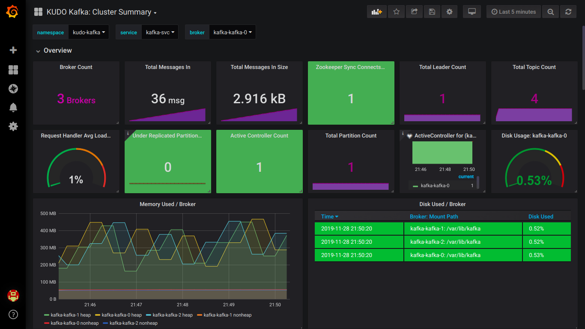

# Monitoring

By default, the KUDO Kafka Operator comes with the JMX Exporter agent enabled. It also includes a Prometheus Node Exporter sidecar container to
export container metrics like the disk usage of persistence volumes used by KUDO Kafka.

When the Kafka operator is deployed with the parameter `METRICS_ENABLED=true` (which defaults to `true`) then:

- Each broker bootstraps with the [JMX Exporter](https://github.com/prometheus/jmx_exporter) java agent exposing the metrics at `9094/metrics`,
  along with a [Prometheus Node Exporter](https://github.com/prometheus/node_exporter) sidecar exposing container metrics at `9096/metrics`.
- Adds a port named `metrics` and `ne-metrics` to the Kafka Service.
- Adds a label `kudo.dev/servicemonitor: "true"` for the service monitor discovery. 
- Mounts a config map with [metrics reporter](https://github.com/kudobuilder/operators/blob/master/repository/kafka/operator/templates/metrics-config.yaml) for the broker container.


```
kubectl describe svc kafka-svc
...
Port:              metrics  9094/TCP
TargetPort:        9094/TCP
...
Port:              ne-metrics  9096/TCP
TargetPort:        9096/TCP
...
```

### Using the Prometheus Service Monitor
To use the prometheus service monitor, it's necessary to have installed the [prometheus operator](https://github.com/coreos/prometheus-operator) previously in the cluster.

Users can monitor the Kafka cluster using independent service monitor. Or use the one that comes with KUDO Kafka

`kubectl kudo install kafka --instance=kafka -p ADD_SERVICE_MONITOR=true`

Or users can provide their own service-monitor. If Kafka is using the default namespace, we can create a [service-monitor](./resources/service-monitor.yaml) with the following:
```
kubectl create -f resources/service-monitor.yaml
```

Upload this [grafana json](./resources/grafana-dashboard.json) and you should see the following Kafka dashboard:



### Disable the metrics

 ```
kubectl kudo install kafka --instance=kafka --parameter METRICS_ENABLED=false
 ```
