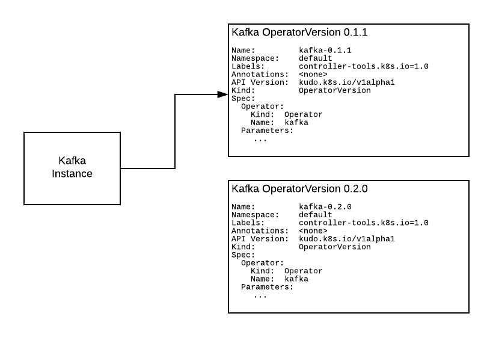
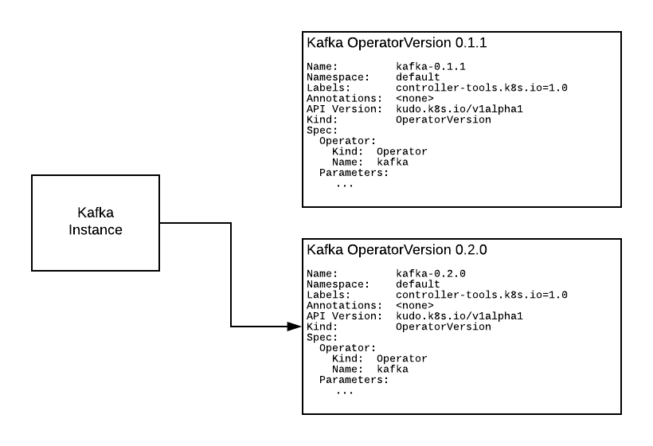

# Upgrading the KUDO Kafka Operator


KUDO upgrades work by linking the Kafka cluster Instance object to the correct operatorVersion object.

We can have multiple operator versions in the same Kubernetes cluster. 
One instance object represents a Kafka Cluster. And different instances can use same or different operator versions.



The upgrade process can be done by patching the Kafka Instance that holds all the configuration around the Kafka cluster, and pointing it to the a new OperatorVersion object.




Lets do the upgrade process only having one Kafka cluster and one Kafka operator version.  

First we need to install the new operator version

```
kubectl kudo install kafka --version=0.2.0 --skip-instance

operator.kudo.k8s.io/kafka unchanged
operatorversion.kudo.k8s.io/v1alpha1/kafka-0.2.0 created
```
Verify if the operator version 0.2.0 is installed. Now we have two operator versions installed. 
```
kubectl  get operatorversions.kudo.k8s.io

NAME              AGE
kafka-0.1.1       2d2h
kafka-0.2.0       2m6s
```

And check the instances that are installed.

```
kubectl get instances
NAME           AGE
kafka-fc6vzn   29h
```

And we can check the plan status of our Kafka cluster `kafka-fc6vzn`  
```
kubectl kudo plan status --instance=kafka-fc6vzn
Plan(s) for "kafka-fc6vzn" in namespace "default":
.
└── kafka-fc6vzn (Operator-Version: "kafka-0.1.1" Active-Plan: "kafka-fc6vzn-deploy-414458000")
    └── Plan deploy (serial strategy) [COMPLETE]
        └── Phase deploy-kafka (serial strategy) [COMPLETE]
            └── Step deploy (COMPLETE)
```
Note the operator version `kafka-0.1.1`

Lets update the Kafka cluster from version 0.1.1 to 0.2.0

```
> kubectl patch instance kafka  -p '{"spec":{"operatorVersion":{"name":"kafka-0.2.0"}}}' --type=merge
instance.kudo.k8s.io/kafka patched
```

We can check the plan status 

```
kubectl kudo plan status --instance=kafka
Plan(s) for "kafka" in namespace "default":
.
└── kafka (Operator-Version: "kafka-0.2.0" Active-Plan: "kafka-deploy-575561000")
    └── Plan deploy (serial strategy) [COMPLETE]
        └── Phase deploy-kafka (serial strategy) [COMPLETE]
            └── Step deploy (COMPLETE)
```

Note the operator-version : kafka-0.2.0, means that we have successfully upgraded the operator

